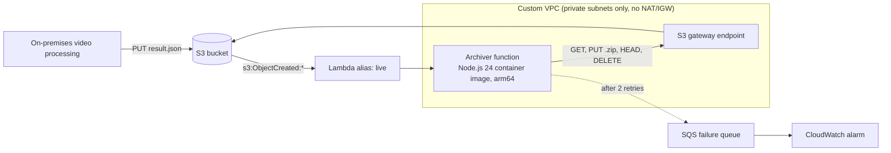

# S3 ZIP Archiver

An AWS Lambda function, deployed with AWS SAM, that compresses every new object in an S3 bucket into a ZIP archive in the same bucket and then deletes the original. The function runs as a container image in private subnets of a dedicated VPC, and every deployment publishes a new Lambda version so releases can be rolled back.

- [Architecture](#architecture)
- [How the assessment tasks are covered](#how-the-assessment-tasks-are-covered)
- [Repository layout](#repository-layout)
- [Design decisions](#design-decisions)
- [Local development and testing](#local-development-and-testing)
- [Deployment](#deployment)
- [Rollback](#rollback)
- [Teardown](#teardown)

## Architecture



For each `ObjectCreated` event the function:

1. Skips keys under the archive prefix (`archived/`), so the ZIP files it writes never loop, and skips empty folder markers.
2. Reads the object with `If-Match` on the ETag from the event, so it archives exactly the object the event describes. A missing or overwritten object means an earlier or newer event owns it.
3. Streams the object through a ZIP encoder straight into an S3 upload (multipart for large archives) at `archived/<original key>.zip`, using `If-None-Match: *` so an existing archive is never overwritten.
4. Confirms the stored archive with `HeadObject`.
5. Deletes the original with `If-Match` on its ETag, or by version ID in a versioned bucket, so an object written to the same key in the meantime is never deleted.

If any step fails, the invocation fails. Lambda retries it twice and then sends the event to an SQS queue watched by an alarm. The original object stays in the bucket until its archive is confirmed.

## How the assessment tasks are covered

| Task | Requirement | Where |
| --- | --- | --- |
| 1 | Lambda built with AWS SAM, Node.js | [`template.yaml`](template.yaml) `ArchiverFunction`, [`src/archiver`](src/archiver) |
| 1 | Triggered by every new object | S3 `s3:ObjectCreated:*` event on the whole bucket |
| 1 | Compress to ZIP, upload to the same bucket | [`lib/zip-upload.mjs`](src/archiver/lib/zip-upload.mjs) |
| 1 | Delete the original after a successful upload | [`lib/handler.mjs`](src/archiver/lib/handler.mjs), after `HeadObject` confirms the archive |
| 2 | S3 bucket and Lambda wiring in one CloudFormation stack in `template.yaml` | [`template.yaml`](template.yaml) |
| 2 | Lambda in private subnets of a VPC defined in the same template | `Vpc`, `PrivateSubnetA/B`, `S3GatewayEndpoint`, `VpcConfig` |
| 2 | Dockerized Lambda | `PackageType: Image`, [`src/archiver/Dockerfile`](src/archiver/Dockerfile) |
| 2 | New version on each deployment, reliable rollback | `AutoPublishAlias: live`, `AutoPublishAliasAllProperties`, `AWS::LanguageExtensions`, `ReleaseId`, [`scripts/rollback.sh`](scripts/rollback.sh) |
| 3 | Incremental commits, README | `git log`, this file |
| 4 | Monthly cost at 1,000,000 files/hour, 10 MB each | [Cost analysis](#cost-analysis) |
| 5 | Scalability, cost efficiency and bottlenecks | [Scalability and bottlenecks](#scalability-and-bottlenecks) |

## Repository layout

```text
.
├── template.yaml                 # SAM/CloudFormation: VPC, bucket, function, alias, failure queue
├── samconfig.toml                # sam build/deploy defaults (stack name, region, ECR repo)
├── Makefile                      # install, lint, test, e2e, validate, build, deploy, rollback, delete
├── src/archiver/
│   ├── Dockerfile                # Lambda container image (public.ecr.aws/lambda/nodejs:24)
│   ├── app.mjs                   # Lambda entry point
│   ├── lib/
│   │   ├── handler.mjs           # event handling, safety checks, conditional delete
│   │   ├── zip-upload.mjs        # streaming S3 -> ZIP -> multipart upload with cleanup
│   │   ├── config.mjs            # environment validation
│   │   └── logger.mjs            # structured JSON logging
│   ├── tests/unit/               # node:test suites with a mocked S3 client
│   └── bench/compression.mjs     # compression ratio/CPU benchmark used for the cost model
├── scripts/
│   ├── e2e-local.sh              # runs the real image against a moto S3 server
│   ├── rollback.sh               # moves the live alias to an earlier version
│   └── cost-estimate.mjs         # reproducible monthly cost model
├── events/s3-object-created.json # sample S3 notification
└── .github/workflows/ci.yml      # lint, unit tests, template validation, e2e
```

## Design decisions

**Streaming instead of buffering.** The S3 response body is piped through `archiver` into `@aws-sdk/lib-storage`. Memory use is bounded by the 5 MiB part size, not by the object size, and `/tmp` is not used, so the default memory and ephemeral storage settings handle objects far larger than 10 MB.

**Nothing is deleted or overwritten without proof.** S3 delivers events at least once, and Lambda retries asynchronous invocations, so every step is safe to repeat:

| Situation | Behaviour |
| --- | --- |
| Duplicate event after success | `GetObject` returns 404 and the record is skipped. `s3:ListBucket` is granted so S3 answers 404 instead of 403. |
| Retry after the archive was stored but the delete failed | The conditional upload returns 412, the existing archive's `source-etag` metadata and size match, it is reused and the source is deleted. |
| Key overwritten before it was read | `GetObject` with `If-Match` returns 412 and the record is skipped. The newer object's own event archives it. |
| Key overwritten while archiving | The conditional `DeleteObject` returns 412 and the newer object is kept. |
| Archive key already holds another generation of the same key | The archive is written to `archived/<key>.<etag>.zip` instead of replacing it. |
| Upload or source stream fails mid-way | The body stream is failed first, so a partial ZIP is never completed, and the multipart upload is aborted. A lifecycle rule also removes incomplete uploads after one day as a backstop. |
| Archive key would exceed S3's 1,024-byte limit | The archive goes to `archived/_long-keys/<sha256>.zip` and the full key is kept as the ZIP entry name. |

**No recursion.** The trigger covers the whole bucket, as the task describes, and archives land under `archived/`. The handler exits early for those keys without calling S3, and logs them at debug level. Setting `SourcePrefix=incoming/` narrows the trigger if uploads can be confined to a prefix; see the savings options.

**Private networking without a NAT gateway.** The VPC has two private subnets in different AZs and no internet or NAT gateway. The function reaches S3 through a gateway VPC endpoint, which has no hourly or data charge. At this workload a NAT gateway would add about $510,000 per month in data processing charges. The endpoint policy and the IAM role both only allow the archive bucket, and the security group allows no inbound traffic. Lambda ships logs and delivers failed events to SQS outside the function's network, so neither needs an endpoint.

**Versioned releases.** `AutoPublishAlias: live` publishes an immutable version and moves the alias, and the S3 notification invokes the alias.
- `AutoPublishAliasAllProperties` publishes a new version when any function setting changes, not only the image.
- `AWS::LanguageExtensions` resolves parameter values before SAM hashes the function. Without it, a parameter-only change would update `$LATEST` but leave the alias on stale configuration.
- `make deploy` passes `ReleaseId=<git sha>-<utc timestamp>`, so every deployment publishes a version labelled with its commit.

**Operations.**
- JSON logs with configurable retention. `SystemLogLevel: WARN` drops the per-invocation START/END/REPORT lines.
- A 14-day SQS failure queue for events that exhaust their retries, with an alarm (optionally wired to SNS) when it is not empty.
- The bucket is encrypted, blocks public access, enforces TLS, and is retained when the stack is deleted.

## Local development and testing

Prerequisites: Node.js 24, Docker, AWS CLI v2, [AWS SAM CLI](https://docs.aws.amazon.com/serverless-application-model/latest/developerguide/install-sam-cli.html), `cfn-lint`, and Python 3 (for the e2e fixtures).

```bash
make install    # npm ci in src/archiver
make lint       # ESLint + cfn-lint
make test       # unit tests (node:test, mocked S3)
make e2e        # real container image + Lambda Runtime Interface Emulator + moto S3
make validate   # sam validate --lint
make build      # sam build (container image)
```

The unit tests cover the safety cases above: conditional operations, archive reuse and generation conflicts, multipart abort on failure, long keys and duplicate deliveries. The e2e test builds the actual image and verifies ZIP contents byte for byte against moto for JSON, Unicode keys and a multipart-sized object, including a replayed event. CI runs all of these on every push and pull request.

Measure compression for the cost model inside the Lambda image. `--cpus 0.58` matches the CPU share of a 1,024 MB function:

```bash
make build
docker run --rm --cpus 0.58 --entrypoint node \
  -v "$PWD/src/archiver/bench:/var/task/bench:ro" \
  archiverfunction:nodejs24 /var/task/bench/compression.mjs
node scripts/cost-estimate.mjs   # regenerate the cost tables
```

## Deployment

The stack has no hourly charges: there is no NAT gateway or interface endpoint, and the S3 gateway endpoint is free. A test deployment therefore fits within the AWS Free Tier. Charges come only from usage (Lambda, S3, CloudWatch Logs) plus a few cents of ECR image storage and one CloudWatch alarm.

```bash
aws configure                      # or export AWS_PROFILE=...
make deploy                        # sam build + sam deploy, region ap-southeast-1 by default
make deploy AWS_REGION=us-east-1   # another region
```

`sam deploy` creates an ECR repository for the image on first use, shows the change set and asks for confirmation. Stack parameters can be overridden, for example:

```bash
make deploy PARAMETER_OVERRIDES="ApplicationLogLevel=WARN SourcePrefix=incoming/ ArchiveStorageClass=GLACIER_IR"
```

Try it:

```bash
BUCKET=$(aws cloudformation describe-stacks --stack-name s3-zip-archiver \
  --query "Stacks[0].Outputs[?OutputKey=='BucketName'].OutputValue" --output text)
echo '{"videoId":"v-1","frames":[{"t":0,"labels":["person"]}]}' > result.json
aws s3 cp result.json "s3://$BUCKET/2026/09/17/result.json"
aws logs tail /aws/lambda/s3-zip-archiver-archiver --follow   # "Archived object"
aws s3 ls "s3://$BUCKET" --recursive                          # archived/2026/09/17/result.json.zip
```

## Rollback

Each deployment publishes a numbered version labelled `release <git sha>-<timestamp>`, and the S3 trigger always invokes the `live` alias.

```bash
make rollback                    # list versions, their release labels and the current alias target
make rollback VERSION=previous   # point live at the version before the current one
make rollback VERSION=7          # point live at a specific version
```

Moving the alias takes effect for the next invocation, with no rebuild. CloudFormation still owns the alias, so make the rollback permanent by reverting the faulty commit and running `make deploy`, which publishes a new version from the reverted code. Keep old images in ECR: an image-based version cannot run once its image is deleted, so any ECR lifecycle policy must keep images for the versions you may roll back to.

## Teardown

```bash
make delete
```

The bucket is retained on purpose so archived data survives stack deletion. Delete it explicitly when you no longer need it (`aws s3 rb "s3://$BUCKET" --force`). Deleting a VPC-attached function can take a while, because Lambda releases its network interfaces asynchronously.
